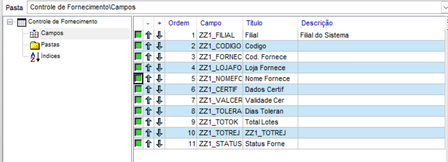
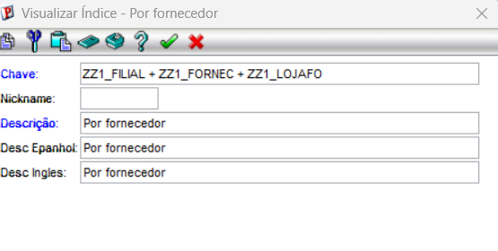
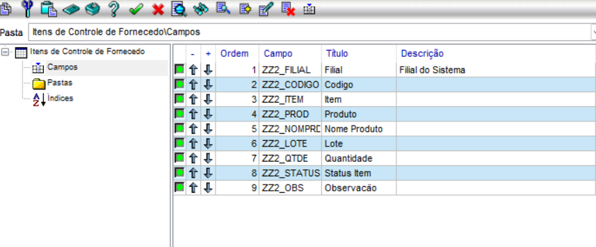
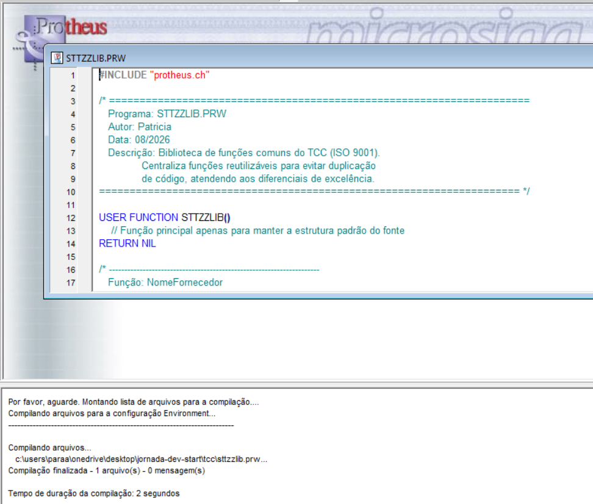
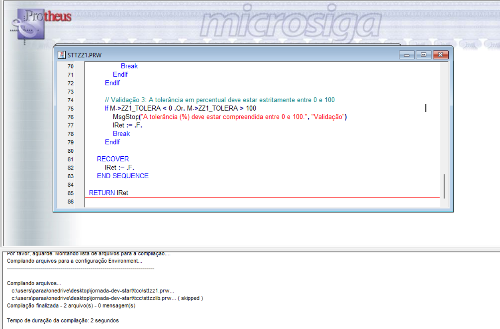
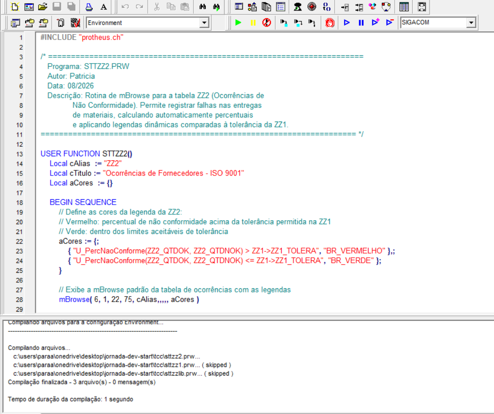

# 📘 Documentação Técnica
# Sistema de Controle de Fornecedores (ISO 9001)

> **Módulo:** Compras (SIGACOM)  
> **ERP:** TOTVS Protheus  
> **Linguagem:** ADVPL (Harbour)  
> **Autor(a):** Patricia Oliveira  
> **Data:** Agosto/2026

---

# 📌 1. Introdução e Visão Geral do Sistema

O presente sistema foi desenvolvido em **ADVPL (Harbour/Protheus)** para atender às necessidades da **Indústria XYZ** no monitoramento das não conformidades na entrada de materiais de fornecedores, garantindo aderência ao processo de certificação da norma **ISO 9001**.

A solução é composta por duas tabelas customizadas (**ZZ1** e **ZZ2**), responsáveis pelo controle de certificados dos fornecedores e pelo registro das ocorrências de qualidade.

Além disso, o projeto contempla:

- Interface desenvolvida com **mBrowse**;
- Legendas dinâmicas por cores;
- Validações de integridade referencial com as tabelas **SA2** (Fornecedores) e **SB1** (Produtos);
- Biblioteca compartilhada de funções auxiliares;
- Tratamento de exceções utilizando **BEGIN SEQUENCE / RECOVER**;
- Registro centralizado de erros em arquivo de log.

Essa arquitetura proporciona maior organização, facilidade de manutenção, reutilização de código e confiabilidade no processo de controle da qualidade dos fornecedores.

---


# 🗄️ 3. Dicionário de Dados e Estrutura de Tabelas

Para que o Protheus reconheça as rotinas e tabelas de controle da qualidade, os dicionários foram estruturados na pasta **`Dados-e-Dicionario/`**, contemplando os arquivos `.dbf` fundamentais:

| Arquivo | Finalidade |
|---------|------------|
| **SX2990.dbf** | Mapeamento das tabelas customizadas em modo compartilhado. |
| **SX3990.dbf** | Especificação detalhada de campos, tipos, tamanhos, decimais e contextos (Reais ou Virtuais). |
| **SIX990.dbf** | Definição de índices primários e secundários para otimização das consultas. |
| **SX7990.dbf** | Configuração de gatilhos (Triggers) para automação de preenchimento. |
| **SXB990.dbf** | Configuração das consultas padrão (F3). |

---

# 3.1. Tabela ZZ1 – Controle de Fornecimento (Certificados)


>

**Acesso:** Compartilhado

**Objetivo:** Armazenar os dados dos certificados de qualidade (ISO 9001) e os limites de tolerância definidos para cada fornecedor.

| Título | Campo | Tipo | Tam | Dec | Contexto | Descrição / Propriedade |
|--------|-------|------|----:|----:|-----------|--------------------------|
| Filial | ZZ1_FILIAL | C | 2 | 0 | Real | Filial do sistema |
| Código | ZZ1_CODIGO | C | 6 | 0 | Real | Chave primária do controle |
| Cód. Fornecedor | ZZ1_FORNEC | C | 6 | 0 | Real | Código do fornecedor (SA2) |
| Loja Fornecedor | ZZ1_LOJAFO | C | 2 | 0 | Real | Loja do fornecedor (SA2) |
| Nome Fornecedor | ZZ1_NOMEFO | C | 40 | 0 | Virtual | Descrição obtida via `POSICIONE()` |
| Dados Certificado | ZZ1_CERTIF | C | 256 | 0 | Real | Número ou descrição do certificado ISO |
| Val. Certificado | ZZ1_VALCER | D | 8 | 0 | Real | Data de validade do certificado |
| Tolerância (%) | ZZ1_TOLERAN | N | 5 | 2 | Real | Percentual máximo de falhas permitido |
| Qtd. Conforme | ZZ1_TOTOK | N | 12 | 2 | Real | Total acumulado de entregas conformes |
| Qtd. Não Conforme | ZZ1_TOTNOK | N | 12 | 2 | Real | Total acumulado de entregas não conformes |

## Índices da ZZ1

1. `ZZ1_FILIAL + ZZ1_CODIGO` *(Chave Primária)*
>
---
2. `ZZ1_FILIAL + ZZ1_FORNEC + ZZ1_LOJAFO` *(Por Fornecedor)*
>
---
3. `ZZ1_FILIAL + DTOS(ZZ1_VALCER)` *(Por Validade do Certificado)*
>
---

# 3.2. Tabela ZZ2 – Ocorrências do Fornecedor

>


**Acesso:** Compartilhado

**Objetivo:** Registrar as ocorrências diárias de itens conformes e não conformes vinculadas ao controle da tabela ZZ1.

| Título | Campo | Tipo | Tam | Dec | Contexto | Descrição / Propriedade |
|--------|-------|------|----:|----:|-----------|--------------------------|
| Filial | ZZ2_FILIAL | C | 2 | 0 | Real | Filial do sistema |
| Controle | ZZ2_CONFOR | C | 6 | 0 | Real | Chave estrangeira da ZZ1 |
| Cód. Fornecedor | ZZ2_FORNEC | C | 6 | 0 | Real | Código do fornecedor herdado da ZZ1 |
| Loja Fornecedor | ZZ2_LOJAFO | C | 2 | 0 | Real | Loja do fornecedor herdada da ZZ1 |
| Nome Fornecedor | ZZ2_NOMEFO | C | 40 | 0 | Virtual | Nome obtido via `POSICIONE()` |
| Data Ocorrência | ZZ2_DATA | D | 8 | 0 | Real | Data da ocorrência |
| Hora | ZZ2_HORA | C | 5 | 0 | Real | Hora da ocorrência |
| Produto | ZZ2_CODPRO | C | 15 | 0 | Real | Código do produto (SB1) |
| Qtde. Conforme | ZZ2_QTDOK | N | 12 | 0 | Real | Quantidade aprovada |
| Qtde. Não Conforme | ZZ2_QTDNOK | N | 12 | 0 | Real | Quantidade rejeitada |
| Valor Unitário | ZZ2_VLRUNI | N | 12 | 2 | Real | Valor unitário do material |
| R$ Conforme | ZZ2_TOTOK | N | 12 | 2 | Virtual | Valor financeiro conforme |
| R$ Não Conforme | ZZ2_TOTNOK | N | 12 | 2 | Virtual | Valor financeiro não conforme |

## Índices da ZZ2

1. `ZZ2_FILIAL + ZZ2_CONFOR + DTOS(ZZ2_DATA) + ZZ2_HORA` *(Chave Primária)*
2. `ZZ2_FILIAL + ZZ2_FORNEC + ZZ2_LOJAFO + DTOS(ZZ2_DATA)` *(Fornecedor/Data)*
3. `ZZ2_FILIAL + DTOS(ZZ2_DATA)` *(Data)*

---

# 💻 4. Estrutura de Códigos-Fonte e Implementação

As rotinas ADVPL foram desenvolvidas utilizando padrões modernos de desenvolvimento, incluindo:

- Tratamento de exceções com `BEGIN SEQUENCE / RECOVER`
- Funções reutilizáveis
- Separação por responsabilidades
- Legendas condicionais
- Validações centralizadas
- Registro de erros em log

---

## 4.1. Biblioteca de Funções Auxiliares (`STTZZLIB.PRW`)

Centraliza funções reutilizáveis do projeto.

### Responsabilidades

- Busca corporativa utilizando `POSICIONE()`;
- Validação de prazos;
- Registro centralizado de exceções em `tcc_erro.log`.

### Evidência de Compilação

>

---

## 4.2. Rotina de Controle de Fornecimento (`STTZZ1.PRW`)

Responsável pelo gerenciamento da tabela **ZZ1**.

### Funcionalidades

- Interface `mBrowse`;
- Legendas dinâmicas por cores;
- Botão para acesso às ocorrências (ZZ2).

### Legendas

| Cor | Significado |
|------|-------------|
| 🔴 Vermelho | Certificado vencido |
| 🟡 Amarelo | Vence em até 30 dias |
| 🟢 Verde | Certificado dentro da validade |

### Evidência de Compilação


> 
 

---

## 4.3. Rotina de Ocorrências (`STTZZ2.PRW`)

Responsável pelo gerenciamento das ocorrências registradas na tabela **ZZ2**.

### Funcionalidades

- Cadastro de ocorrências;
- Filtro relacional (`STTZZ2FLT`);
- Validação de integridade dos dados.

### Evidência de Compilação

 > 

---

# ⚙️ 5. Regras, Validações (SX3) e Gatilhos (SX7)

## 5.1. Validações de Dados (SX3)

### Tabela ZZ1

### Campo `ZZ1_FORNEC`

Valida se o fornecedor existe na SA2.

```advpl
ExistCpo("SA2", xFilial("SA2") + M->ZZ1_FORNEC + M->ZZ1_LOJAFO, 1)
```

---

### Campo `ZZ1_VALCER`

Impede inclusão de certificados com data vencida.

```advpl
M->ZZ1_VALCER >= dDataBase
```

---

### Campo `ZZ1_TOLERA`

Permite somente valores entre 0% e 100%.

```advpl
M->ZZ1_TOLERA >= 0 .AND. M->ZZ1_TOLERA <= 100
```

---

### Tabela ZZ2

### Campo `ZZ2_CONFOR`

Valida se o controle informado existe na ZZ1.

```advpl
ExistCpo("ZZ1", xFilial("ZZ1") + M->ZZ2_CONFOR, 1)
```

---

### Campo `ZZ2_CODPRO`

Valida existência do produto.

```advpl
ExistCpo("SB1", xFilial("SB1") + M->ZZ2_CODPRO, 1)
```

---

### Campo `ZZ2_DATA`

Impede lançamentos futuros.

```advpl
M->ZZ2_DATA <= dDataBase
```

---

## 5.2. Configuração de Gatilhos (SX7)

### ZZ1_FORNEC → ZZ1_NOMEFO

```advpl
POSICIONE("SA2",1,xFilial("SA2")+M->ZZ1_FORNEC+M->ZZ1_LOJAFO,"A2_NOME")
```

---

### ZZ2_CONFOR → ZZ2_FORNEC

```advpl
POSICIONE("ZZ1",1,xFilial("ZZ1")+M->ZZ2_CONFOR,"ZZ1_FORNEC")
```

---

### ZZ2_CONFOR → ZZ2_LOJAFO

```advpl
POSICIONE("ZZ1",1,xFilial("ZZ1")+M->ZZ2_CONFOR,"ZZ1_LOJAFO")
```

---

### ZZ2_CONFOR → ZZ2_NOMEFO

```advpl
POSICIONE("SA2",1,xFilial("SA2")+M->ZZ2_FORNEC+M->ZZ2_LOJAFO,"A2_NOME")
```

---

### ZZ2_DATA → ZZ2_DATA

```advpl
IF(INCLUI, dDataBase, ZZ2->ZZ2_DATA)
```

---

### ZZ2_HORA → ZZ2_HORA

```advpl
IF(INCLUI, Time(), ZZ2->ZZ2_HORA)
```

---

# 🚀 6. Instalação e Homologação

## 1. Copiar os arquivos

Copie a pasta:

```text
Dados-e-Dicionario/
```

para o diretório raiz do **Protheus Server**, juntamente com:

- `sigacom.xnu`

---

## 2. Abrir o projeto

No Dev Studio (ou IDE equivalente), abra:

```text
TCC.PRJ
```

---

## 3. Compilar os fontes

Compile exatamente nesta ordem:

```text
STTZZLIB.PRW
STTZZ1.PRW
STTZZ2.PRW
```

---

## 4. Executar o sistema

Abra o **SmartClient**.

Acesse:

```text
SIGACOM → Compras
```

---

## 5. Validar

Realize a homologação verificando:

- Cadastro dos certificados (ZZ1);
- Registro das ocorrências (ZZ2);
- Validações de campos;
- Funcionamento dos gatilhos;
- Atualização automática das informações;
- Legendas por cores;
- Consultas e índices;
- Fluxo completo do controle de qualidade ISO 9001.

---