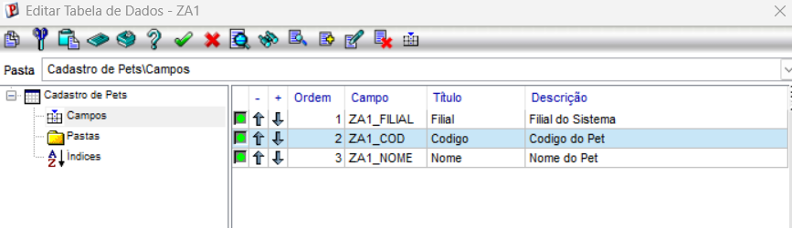
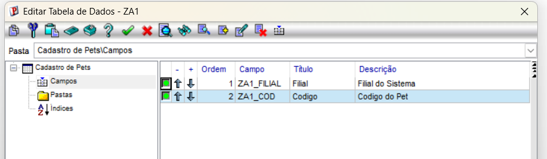
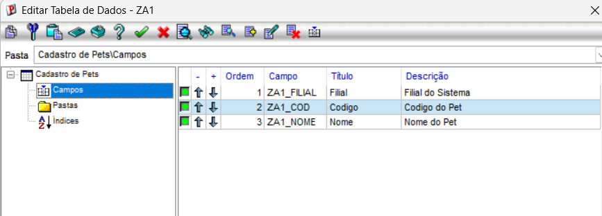

# Exercício 3 — Recriando a ZA1 no Configurador

## Descrição do Passo a Passo (Ambiente / Configurador)

Como o exercício envolve a manipulação do dicionário de dados, descrevo abaixo o procedimento técnico detalhado executado no ambiente Protheus para a recriação da tabela customizada de Pets:

### a. Cadastro da Estrutura no Dicionário (SX2 / SX3)
1. **Acesso ao Configurador (SIGACFG):** Acessar o módulo de parametrização e segurança com credenciais de administrador.
2. **Atualização da Tabela (SX2 - Parâmetros de Empresas):** 
   * Navegar em *Base de Dados* > *Dicionário* > *Base de Dados*.
   * Inserir um novo registro na tabela **SX2** (`ZA1` - Cadastro de Pets).

> **📸 Evidência / Print 1:** Inserção da tabela ZA1 no Configurador (SX2)
> `

3. **Criação dos Campos (SX3 - Campos):**
   * Acessar *Base de Dados* > *Dicionário* > *Campos* e cadastrar a estrutura (`ZA1_FILIAL`, `ZA1_CODIGO`, `ZA1_NOME`, `ZA1_RACA`, `ZA1_NASC`).

> **📸 Evidência / Print 2:** Criação dos campos da tabela ZA1 no SX3
> `

### b. Reconhecimento da Tabela pelo Framework
* Executou-se a rotina de atualização do sistema para forçar o framework a reconhecer a nova estrutura física e lógica no banco de dados.

### c. Conferência Estrutural no MPSDU
* Abertura da ferramenta utilitária **MPSDU** para confirmação visual da tabela **ZA1** gerada corretamente.

> **📸 Evidência / Print 3:** Conferência da tabela ZA1 gerada
> 