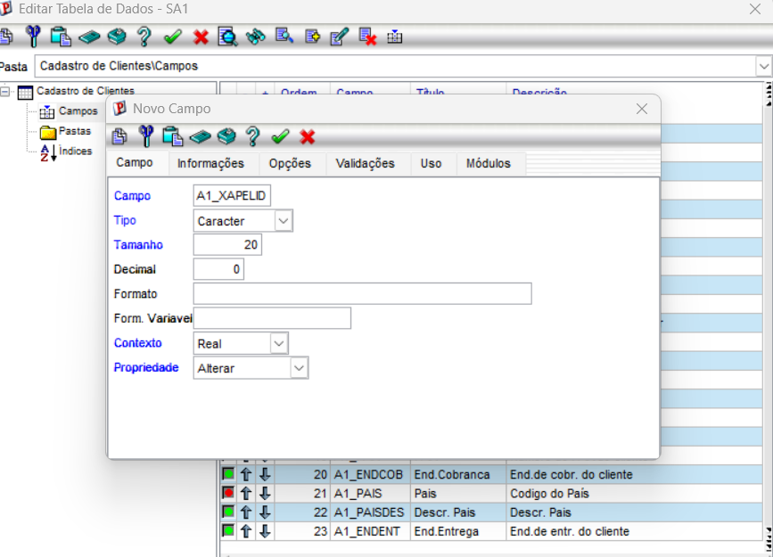
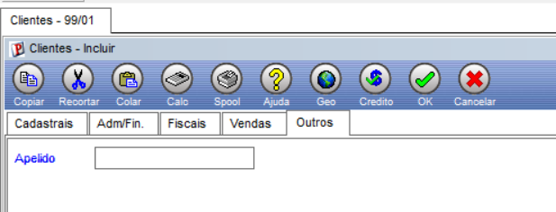

# Documentação: Criação de Campo Customizado (A1_XAPELID) no Protheus

## 1. Objetivo
Documentar o procedimento de criação do campo customizado de **Apelido** (`A1_XAPELID`) na tabela de Clientes (`SA1`) do Protheus e a sua validação na interface do sistema.

---

## 2. Passo a Passo Realizado

1. **Acesso ao Configurador (`SIGACFG`):**
   * Utilizado para gerenciar o Dicionário de Dados.
2. **Criação do Campo na Tabela SA1:**
   * **Nome do Campo:** `A1_XAPELID`
   * **Título:** Apelido
   * **Tipo:** Caracter
   * **Tamanho:** 20
3. **Validação no Módulo de Faturamento (`SIGAFAT`):**
   * Acesso à rotina de Clientes (`MATA030`).
   * Verificação do campo posicionado na aba **Outros** da tela de cadastro.

---

## 3. Evidência (Print da Tela)

Abaixo segue o registro visual do campo Apelido integrado com sucesso no cadastro de clientes:

### 3.1. Configuração no Dicionário de Dados

