# 🐶 Exercício 02 — Criação da Tabela ZA1 (Cadastro de Pets)

## Objetivo

Criar uma tabela personalizada (**ZA1**) no Dicionário de Dados do Protheus, cadastrar seus campos, configurar um campo virtual e criar os índices necessários para utilização no cadastro de Pets.

---

# Etapa 1 — Criação da Tabela (SX2)

Foi criada a tabela **ZA1** com as seguintes configurações:

| Campo | Valor |
|--------|--------|
| Prefixo | ZA1 |
| Nome | ZA1990 |
| Descrição | Cadastro de Pets |
| Path | \DATA\ |
| Modo de Acesso | Compartilhado |

### 📷 Evidência

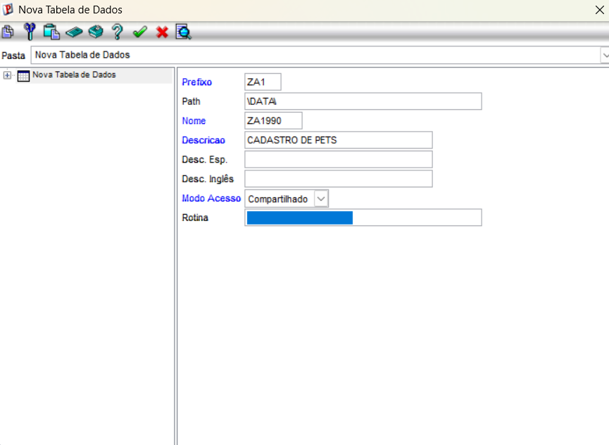

---

# Etapa 2 — Cadastro dos Campos (SX3)

Após criar a tabela, foram cadastrados os seguintes campos:

| Campo | Tipo | Tamanho | Descrição |
|--------|------|----------|-----------|
| ZA1_COD | Caracter | 6 | Código do Pet |
| ZA1_NOME | Caracter | 40 | Nome do Pet |
| ZA1_CLIENT | Caracter | 6 | Código do Cliente |
| ZA1_LOJA | Caracter | 2 | Loja do Cliente |
| ZA1_DTNASC | Data | 8 | Data de Nascimento |
| ZA1_RACA | Caracter | 30 | Raça do Pet |
| ZA1_NOMCLI | Virtual | 40 | Nome do Cliente |

---

## Inclusão dos Campos

### 📷 Tela de inclusão de campos

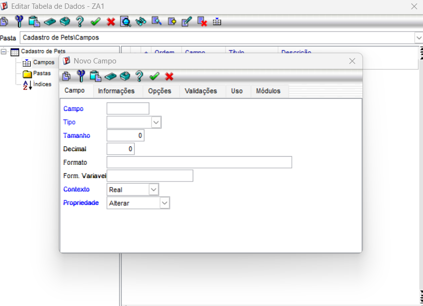

---

### 📷 Campo ZA1_COD

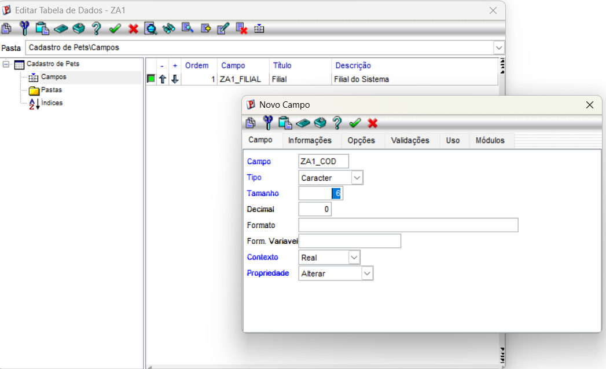

---

### 📷 Campo ZA1_NOME

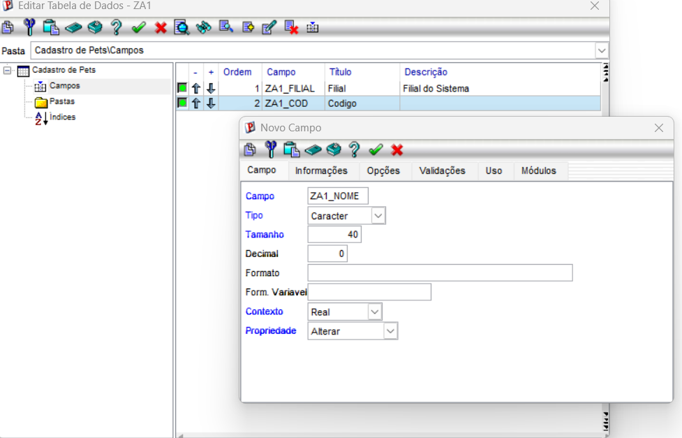

---

### 📷 Campo ZA1_CLIENT

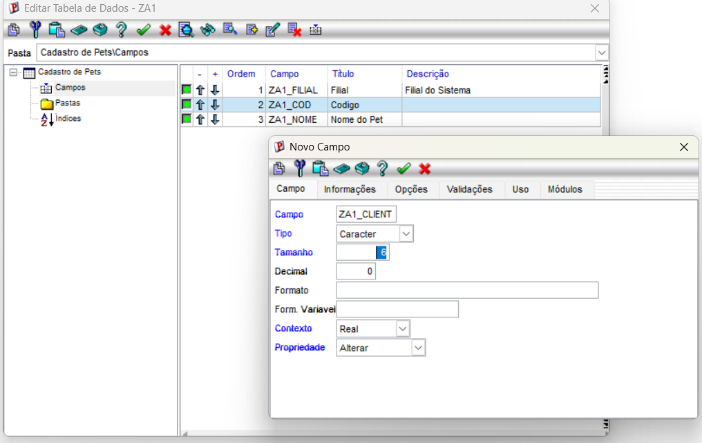

---

### 📷 Campo ZA1_LOJA

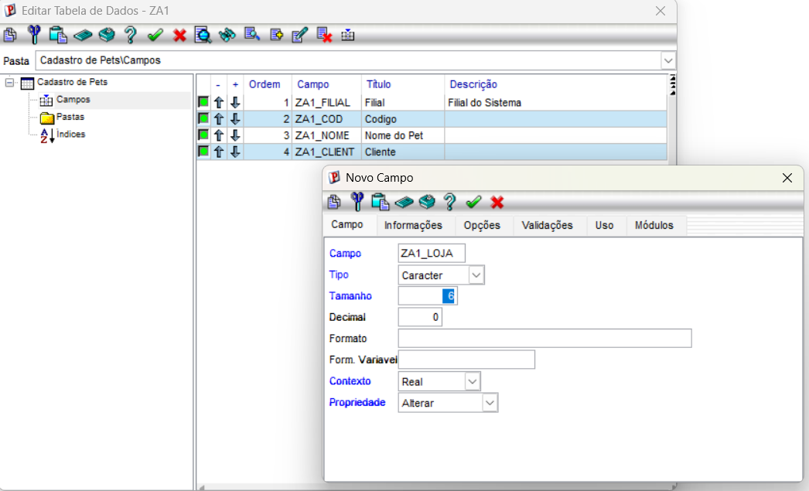

---

### 📷 Campo ZA1_DTNASC

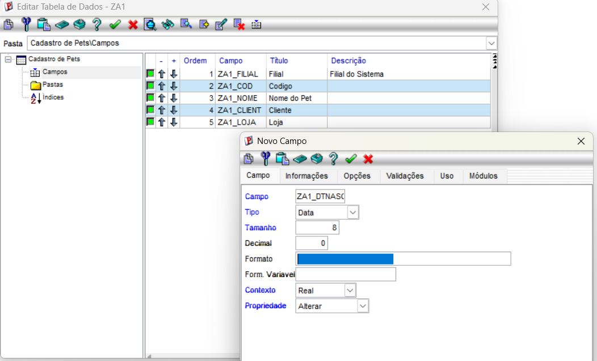

---

### 📷 Campo ZA1_RACA

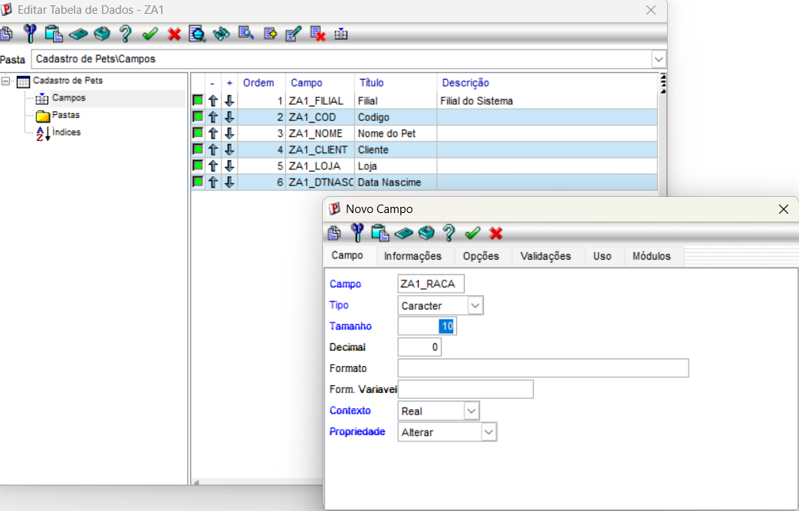

---

### 📷 Campo Virtual ZA1_NOMCLI

A relação utilizada foi:

```advpl
POSICIONE("SA1",1,xFilial("SA1")+M->ZA1_CLIENT+M->ZA1_LOJA,"A1_NOME")
```

### 📷 Evidência

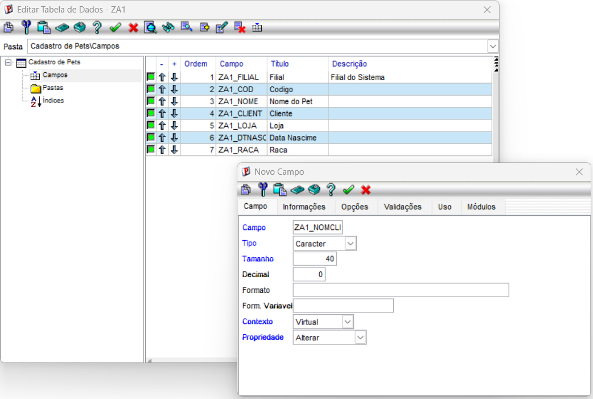

---

## Relação dos campos cadastrados

### 📷 Evidência


---

# Etapa 3 — Criação dos Índices (SIX)

Foram criados dois índices para facilitar as pesquisas da tabela.

| Ordem | Chave | Finalidade |
|-------:|-------|------------|
| 1 | ZA1_FILIAL + ZA1_COD | Pesquisa por código |
| 2 | ZA1_FILIAL + ZA1_CLIENT + ZA1_LOJA | Pesquisa por cliente |

---

### 📷 Tela de Índices

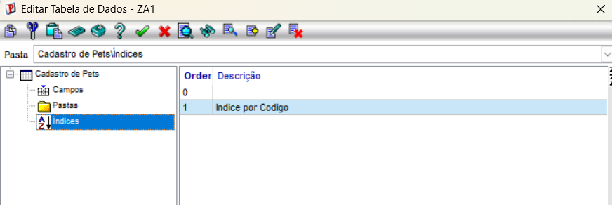

---

### 📷 Inclusão do Índice 1

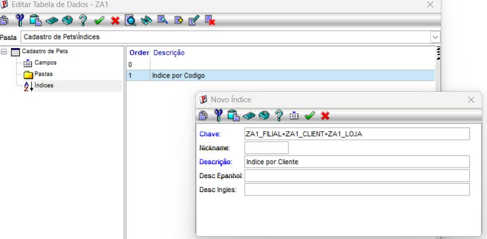

---

### 📷 Índice 1 criado

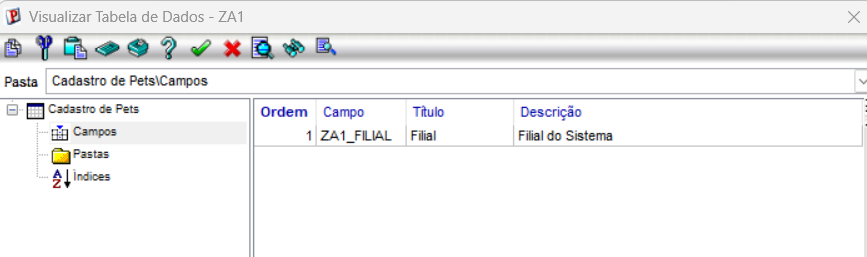

---

### 📷 Índices  criado

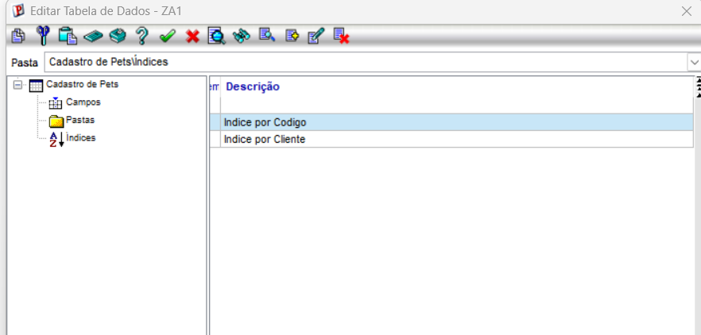

---

# Conclusão

Ao final deste exercício foi criada a tabela **ZA1 (Cadastro de Pets)** contendo:

- Estrutura da tabela (SX2);
- Campos (SX3);
- Campo Virtual utilizando **POSICIONE()**;
- Índices (SIX).

Essa estrutura será utilizada no próximo exercício para criar o CRUD utilizando **AxCadastro**.