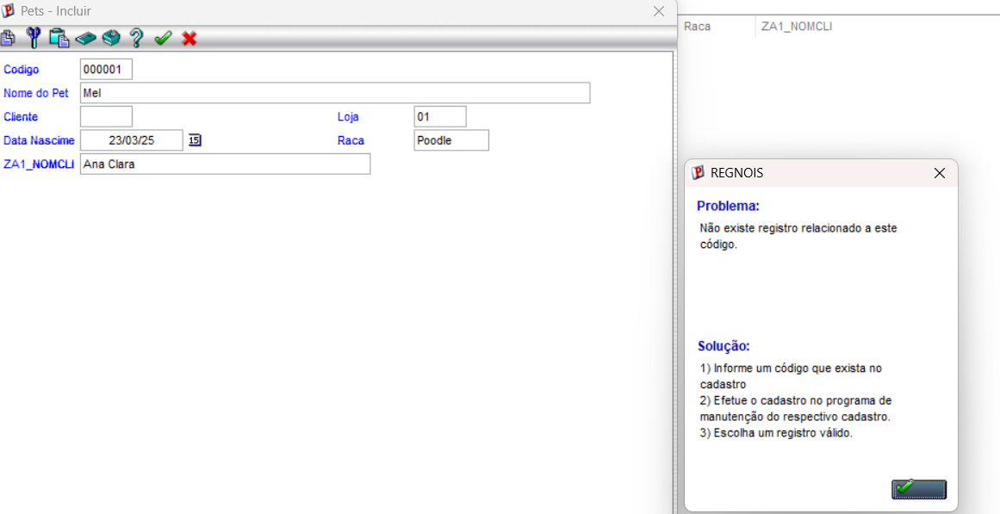

# Exercício 04 - Validação com ExistCpo

Neste exercício, implementamos a validação do campo de cliente na tabela de Pets utilizando a função `ExistCpo`, garantindo que o sistema impeça a digitação de códigos inválidos que não existem na tabela padrão de clientes (`SA1`).

## Evidência de Execução
Abaixo o pop-up de erro gerado pelo sistema ao tentar informar um código de cliente inexistente:

