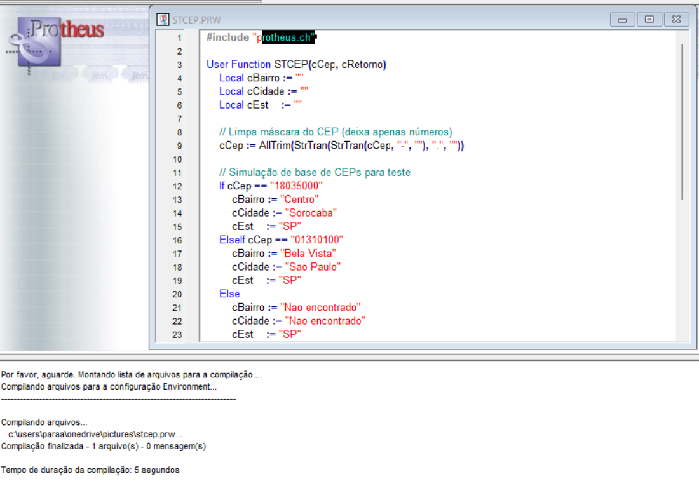
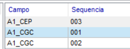
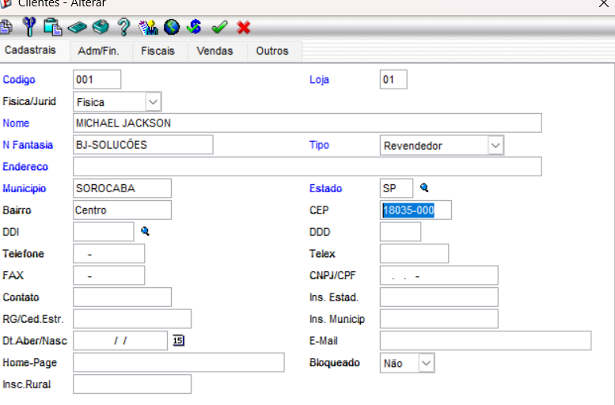

# Documentação Técnica: Implementação de Gatilhos de CEP no Protheus (SX7)

 
---

## 1. Introdução
Este documento detalha o procedimento técnico realizado para a automação do preenchimento de endereços (Bairro, Município e UF) a partir do campo **CEP (`A1_CEP`)** no cadastro de clientes (`SA1`) do TOTVS Protheus, utilizando a função customizada `U_STCEP`.

---

## 2. Compilação da Função Customizada (`stcep.prw`)
O primeiro passo consistiu no desenvolvimento e compilação da User Function responsável por processar os dados do CEP e retornar as informações correspondentes de localidade.

* **Status:** Compilado com sucesso no ambiente de desenvolvimento Protheus.
* **Arquivo:** `stcep.prw`

---

## 3. Configuração dos Gatilhos no SX7
Para automatizar o preenchimento, foram configuradas três sequências de gatilhos vinculadas ao campo **A1_CEP** na tabela **SX7**, garantindo que Bairro, Município e Estado sejam preenchidos de forma dinâmica.

### Detalhes das Sequências Cadastradas:
| Campo Origem | Sequência | Campo Domínio (Destino) | Tipo | Regra de Execução | Posiciona |
| :--- | :---: | :--- | :--- | :--- | :---: |
| `A1_CEP` | `001` | `A1_BAIRRO` | Primario | `U_STCEP(M->A1_CEP,"BAIRRO")` | Não |
| `A1_CEP` | `002` | `A1_MUN` | Primario | `U_STCEP(M->A1_CEP,"CIDADE")` | Não |
| `A1_CEP` | `003` | `A1_EST` | Primario | `U_STCEP(M->A1_CEP,"UF")` | Não |

---

## 4. Teste Prático e Validação no SmartClient (MATA030)
Após a compilação do código e o cadastro dos gatilhos no dicionário de dados (SX7), realizou-se o teste prático no módulo de Faturamento (`SIGAFAT`), rotina de Clientes (`MATA030`).

* **Comportamento Observado:** Ao inserir o CEP válido e pressionar a tecla *Tab*, a rotina executou com sucesso a função `U_STCEP`, populando automaticamente os campos correspondentes de endereço na interface do usuário.

---

## 5. Conclusão
A implementação foi concluída com êxito, otimizando o processo de cadastro de clientes e eliminando a necessidade de digitação manual de dados geográficos recorrentes.