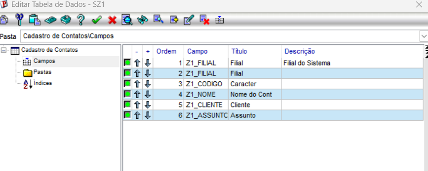
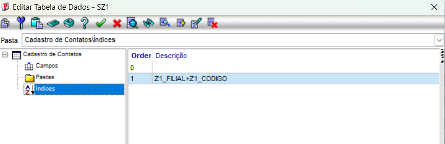
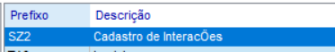
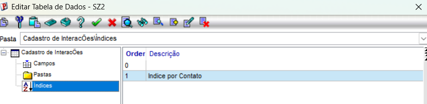

# 📚 Exercício 01 — Dicionário de Dados (SZ1 e SZ2)

## Objetivo

Configurar as tabelas **SZ1 (Contatos)** e **SZ2 (Interações)** no Dicionário de Dados do Protheus, preparando a estrutura necessária para o projeto CRUD do módulo.

---

# O que será configurado

Durante este exercício serão criados:

- Tabela SZ1
- Tabela SZ2
- Campos (SX3)
- Índices (SIX)
- Domínio SX5 para os tipos de interação

---

# Evidências

## 📷 Criação da tabela SZ1

> 

---

## 📷 Campos da tabela SZ1

> 

---

## 📷 Índices da tabela SZ1

> 

---

## 📷 Criação da tabela SZ2

> 

---

## 📷 Campos da tabela SZ2

> 

---

## 📷 Índices da tabela SZ2

> 

---

## 📷 Domínio SX5

> Inserir imagem

---

# Conclusão

Após a configuração do dicionário, as tabelas ficaram preparadas para serem utilizadas pelas rotinas desenvolvidas nos próximos exercícios do módulo.