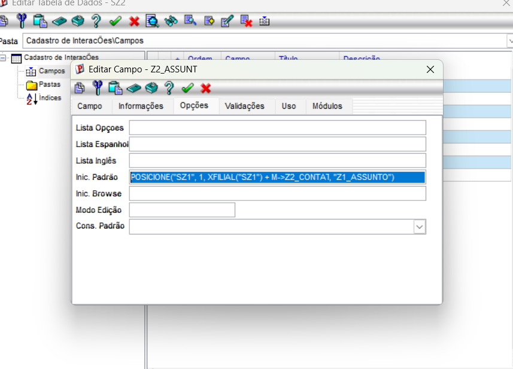
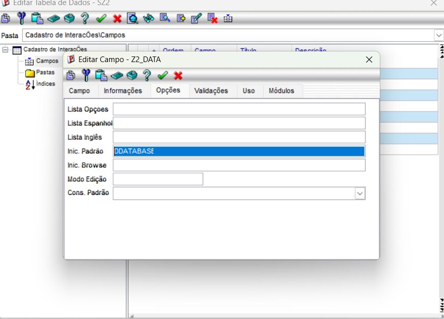
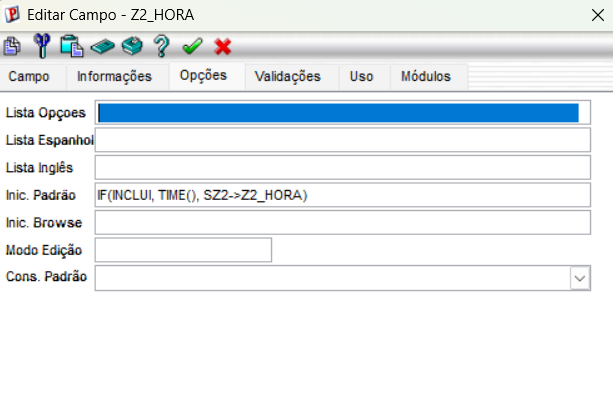
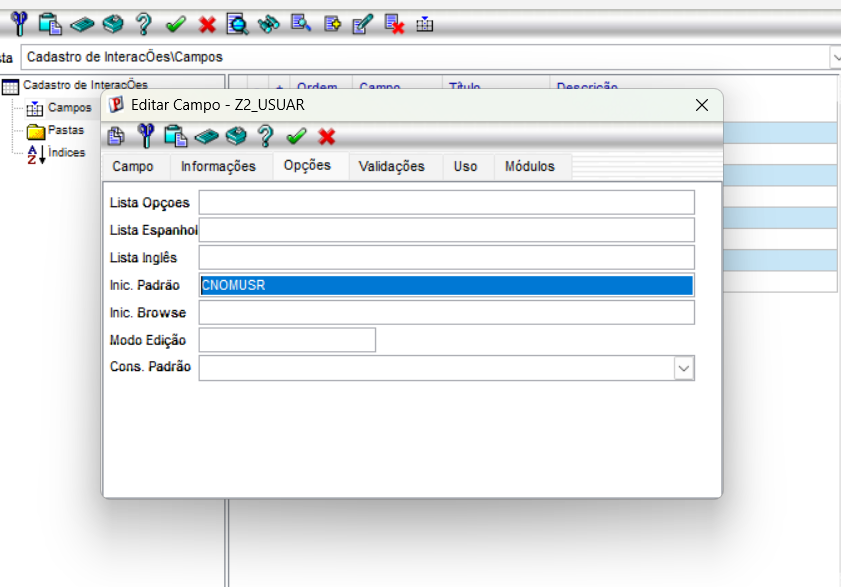
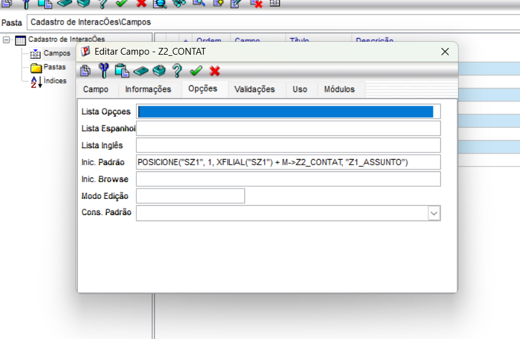

# 📚 Exercício 03 — Gatilhos e Validações (Tabela SZ2)

## Objetivo

Configurar regras de integridade, inicializações padrão e validações cruzadas na tabela de interações (`SZ2`) no Dicionário de Dados do Protheus [cite: Gemini Conversations for "Os detalhes do exercício 3 sobre gatilhos e validações incluem a configuração de campos virtuais na tabela SZ2 (`Z2_CODIGO` e `Z2_ASSUNT`) através do `POSICIONE` no `X3_RELACAO`. O exercício também solicita gatilhos automáticos para `Z2_DATA` (com `dDataBase`), `Z2_HORA` (usando `IF(INCLUI, Time(), SZ2->Z2_HORA)`) e `Z2_USUAR` (com `cNomUsr`), além de uma validação cruzada no `X3_VALID` do campo `Z2_CONTAT` utilizando a função `ExistCpo`. O objetivo é tornar o sistema mais funcional e inteligente por meio dessas regras de integridade."], automatizando o preenchimento de informações e garantindo a consistência e a integridade dos dados durante os lançamentos [cite: Gemini Conversations for "Os detalhes do exercício 3 sobre gatilhos e validações incluem a configuração de campos virtuais na tabela SZ2 (`Z2_CODIGO` e `Z2_ASSUNT`) através do `POSICIONE` no `X3_RELACAO`. O exercício também solicita gatilhos automáticos para `Z2_DATA` (com `dDataBase`), `Z2_HORA` (usando `IF(INCLUI, Time(), SZ2->Z2_HORA)`) e `Z2_USUAR` (com `cNomUsr`), além de uma validação cruzada no `X3_VALID` do campo `Z2_CONTAT` utilizando a função `ExistCpo`. O objetivo é tornar o sistema mais funcional e inteligente por meio dessas regras de integridade."].

---

# O que foi configurado

Durante este exercício foram aplicadas as seguintes regras na tabela **SZ2**:

- **Índice de Relacionamento (SIX):** Criação/ajuste do índice na tabela de contatos para dar suporte às buscas.
- **Campo Virtual de Assunto (`Z2_ASSUNT`):** Utilização da função `POSICIONE` na inicialização padrão para buscar automaticamente o assunto do contato [cite: Gemini Conversations for "Os detalhes do exercício 3 sobre gatilhos e validações incluem a configuração de campos virtuais na tabela SZ2 (`Z2_CODIGO` e `Z2_ASSUNT`) através do `POSICIONE` no `X3_RELACAO`. O exercício também solicita gatilhos automáticos para `Z2_DATA` (com `dDataBase`), `Z2_HORA` (usando `IF(INCLUI, Time(), SZ2->Z2_HORA)`) e `Z2_USUAR` (com `cNomUsr`), além de uma validação cruzada no `X3_VALID` do campo `Z2_CONTAT` utilizando a função `ExistCpo`. O objetivo é tornar o sistema mais funcional e inteligente por meio dessas regras de integridade."].
- **Automação de Data (`Z2_DATA`):** Preenchimento automático com a data do sistema (`dDataBase`) [cite: Gemini Conversations for "Os detalhes do exercício 3 sobre gatilhos e validações incluem a configuração de campos virtuais na tabela SZ2 (`Z2_CODIGO` e `Z2_ASSUNT`) através do `POSICIONE` no `X3_RELACAO`. O exercício também solicita gatilhos automáticos para `Z2_DATA` (com `dDataBase`), `Z2_HORA` (usando `IF(INCLUI, Time(), SZ2->Z2_HORA)`) e `Z2_USUAR` (com `cNomUsr`), além de uma validação cruzada no `X3_VALID` do campo `Z2_CONTAT` utilizando a função `ExistCpo`. O objetivo é tornar o sistema mais funcional e inteligente por meio dessas regras de integridade."].
- **Automação de Hora (`Z2_HORA`):** Registro do horário exato no momento da inclusão (`IF(INCLUI, Time(), SZ2->Z2_HORA)`) [cite: Gemini Conversations for "Os detalhes do exercício 3 sobre gatilhos e validações incluem a configuração de campos virtuais na tabela SZ2 (`Z2_CODIGO` e `Z2_ASSUNT`) através do `POSICIONE` no `X3_RELACAO`. O exercício também solicita gatilhos automáticos para `Z2_DATA` (com `dDataBase`), `Z2_HORA` (usando `IF(INCLUI, Time(), SZ2->Z2_HORA)`) e `Z2_USUAR` (com `cNomUsr`), além de uma validação cruzada no `X3_VALID` do campo `Z2_CONTAT` utilizando a função `ExistCpo`. O objetivo é tornar o sistema mais funcional e inteligente por meio dessas regras de integridade."].
- **Automação de Usuário (`Z2_USUAR`):** Identificação do operador logado via `cNomUsr` [cite: Gemini Conversations for "Os detalhes do exercício 3 sobre gatilhos e validações incluem a configuração de campos virtuais na tabela SZ2 (`Z2_CODIGO` e `Z2_ASSUNT`) através do `POSICIONE` no `X3_RELACAO`. O exercício também solicita gatilhos automáticos para `Z2_DATA` (com `dDataBase`), `Z2_HORA` (usando `IF(INCLUI, Time(), SZ2->Z2_HORA)`) e `Z2_USUAR` (com `cNomUsr`), além de uma validação cruzada no `X3_VALID` do campo `Z2_CONTAT` utilizando a função `ExistCpo`. O objetivo é tornar o sistema mais funcional e inteligente por meio dessas regras de integridade."].
- **Validação de Contato (`Z2_CONTAT`):** Validação cruzada utilizando a função `ExistCpo` para impedir o cadastro de códigos inexistentes [cite: Gemini Conversations for "Os detalhes do exercício 3 sobre gatilhos e validações incluem a configuração de campos virtuais na tabela SZ2 (`Z2_CODIGO` e `Z2_ASSUNT`) através do `POSICIONE` no `X3_RELACAO`. O exercício também solicita gatilhos automáticos para `Z2_DATA` (com `dDataBase`), `Z2_HORA` (usando `IF(INCLUI, Time(), SZ2->Z2_HORA)`) e `Z2_USUAR` (com `cNomUsr`), além de uma validação cruzada no `X3_VALID` do campo `Z2_CONTAT` utilizando a função `ExistCpo`. O objetivo é tornar o sistema mais funcional e inteligente por meio dessas regras de integridade."].

---

# Evidências

## 📷 Índice de Relacionamento SZ2
> O índice foi configurado para organizar as buscas por contato dentro da tabela de interações.

> 

---

## 📷 Inicialização Padrão - Campo Z2_ASSUNT
> Configurado o campo virtual utilizando a função `POSICIONE` para puxar os dados de assunto do contato de forma automatizada:
> `POSICIONE("SZ1", 1, xFilial("SZ1") + M->Z2_CONTAT, "Z1_ASSUNTO")`

> 

---

## 📷 Inicialização Padrão - Campo Z2_DATA
> Configurado o gatilho padrão de data utilizando a variável nativa `dDataBase` [cite: Gemini Conversations for "Os detalhes do exercício 3 sobre gatilhos e validações incluem a configuração de campos virtuais na tabela SZ2 (`Z2_CODIGO` e `Z2_ASSUNT`) através do `POSICIONE` no `X3_RELACAO`. O exercício também solicita gatilhos automáticos para `Z2_DATA` (com `dDataBase`), `Z2_HORA` (usando `IF(INCLUI, Time(), SZ2->Z2_HORA)`) e `Z2_USUAR` (com `cNomUsr`), além de uma validação cruzada no `X3_VALID` do campo `Z2_CONTAT` utilizando a função `ExistCpo`. O objetivo é tornar o sistema mais funcional e inteligente por meio dessas regras de integridade."].

> 

---

## 📷 Inicialização Padrão - Campo Z2_HORA
> Configurado o preenchimento de hora condicionado ao momento da inclusão por meio da fórmula:
> `IF(INCLUI, Time(), SZ2->Z2_HORA)` [cite: Gemini Conversations for "Os detalhes do exercício 3 sobre gatilhos e validações incluem a configuração de campos virtuais na tabela SZ2 (`Z2_CODIGO` e `Z2_ASSUNT`) através do `POSICIONE` no `X3_RELACAO`. O exercício também solicita gatilhos automáticos para `Z2_DATA` (com `dDataBase`), `Z2_HORA` (usando `IF(INCLUI, Time(), SZ2->Z2_HORA)`) e `Z2_USUAR` (com `cNomUsr`), além de uma validação cruzada no `X3_VALID` do campo `Z2_CONTAT` utilizando a função `ExistCpo`. O objetivo é tornar o sistema mais funcional e inteligente por meio dessas regras de integridade."]

> 
---

## 📷 Inicialização Padrão - Campo Z2_USUAR
> Configurado o registro automático do usuário logado através da macro `cNomUsr` [cite: Gemini Conversations for "Os detalhes do exercício 3 sobre gatilhos e validações incluem a configuração de campos virtuais na tabela SZ2 (`Z2_CODIGO` e `Z2_ASSUNT`) através do `POSICIONE` no `X3_RELACAO`. O exercício também solicita gatilhos automáticos para `Z2_DATA` (com `dDataBase`), `Z2_HORA` (usando `IF(INCLUI, Time(), SZ2->Z2_HORA)`) e `Z2_USUAR` (com `cNomUsr`), além de uma validação cruzada no `X3_VALID` do campo `Z2_CONTAT` utilizando a função `ExistCpo`. O objetivo é tornar o sistema mais funcional e inteligente por meio dessas regras de integridade."].

> 

---

## 📷 Validação Cruzada - Campo Z2_CONTAT
> Implementada a consistência de dados por meio da função `ExistCpo`, garantindo que o contato informado pertença efetivamente à tabela relacionada `SZ1`:
> `ExistCpo("SZ1", M->Z2_CONTAT, 1)` [cite: Gemini Conversations for "Os detalhes do exercício 3 sobre gatilhos e validações incluem a configuração de campos virtuais na tabela SZ2 (`Z2_CODIGO` e `Z2_ASSUNT`) através do `POSICIONE` no `X3_RELACAO`. O exercício também solicita gatilhos automáticos para `Z2_DATA` (com `dDataBase`), `Z2_HORA` (usando `IF(INCLUI, Time(), SZ2->Z2_HORA)`) e `Z2_USUAR` (com `cNomUsr`), além de uma validação cruzada no `X3_VALID` do campo `Z2_CONTAT` utilizando a função `ExistCpo`. O objetivo é tornar o sistema mais funcional e inteligente por meio dessas regras de integridade."]

> 

---

# Conclusão

Com essas configurações aplicadas no Dicionário de Dados, a tabela `SZ2` passou a contar com automações inteligentes e regras rígidas de validação [cite: Gemini Conversations for "Os detalhes do exercício 3 sobre gatilhos e validações incluem a configuração de campos virtuais na tabela SZ2 (`Z2_CODIGO` e `Z2_ASSUNT`) através do `POSICIONE` no `X3_RELACAO`. O exercício também solicita gatilhos automáticos para `Z2_DATA` (com `dDataBase`), `Z2_HORA` (usando `IF(INCLUI, Time(), SZ2->Z2_HORA)`) e `Z2_USUAR` (com `cNomUsr`), além de uma validação cruzada no `X3_VALID` do campo `Z2_CONTAT` utilizando a função `ExistCpo`. O objetivo é tornar o sistema mais funcional e inteligente por meio dessas regras de integridade."]. Isso otimiza a experiência do usuário durante os lançamentos, reduz erros operacionais e assegura a integridade referencial entre as tabelas do projeto.