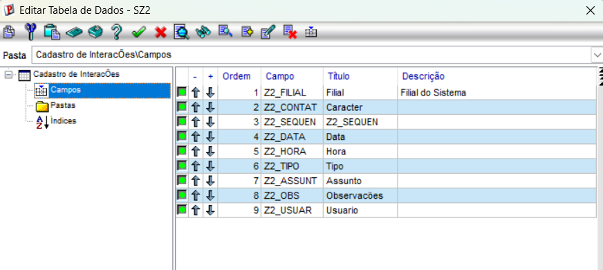

# 📚 Exercício 04 — Menu no SIGACOM

## Objetivo

Configurar o menu do módulo de Compras (`SIGACOM`) no Configurador do Protheus, adicionando as rotinas personalizadas do projeto para acesso direto pelos usuários.

---

# O que foi configurado

Durante este exercício, a árvore de opções do módulo de Compras foi atualizada com as seguintes rotinas:

- **Contatos:** Associação da função `U_STTIP003` para a gestão de contatos da tabela `SZ1`.
- **Interações (Geral):** Associação da função `U_STTIP004B` (versão sem filtro, de listagem geral) para visualização completa das interações da tabela `SZ2`.

---

# Evidências

## 📷 Configuração do Menu de Compras no Configurador
> Inclusão das rotinas personalizadas `U_STTIP003` (Contatos) e `U_STTIP004B` (Interações) dentro da estrutura de Cadastros do SIGACOM.

<!-- COLOQUE A IMAGEM AQUI -->
> 

---

# Conclusão

Com a alteração realizada no Configurador, as rotinas do projeto passaram a integrar oficialmente o menu do módulo de Compras do Protheus, permitindo que os operadores acessem os cadastros de contatos e interações de forma prática e centralizada.